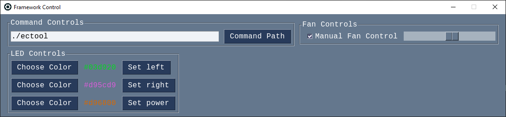

# fw-ec-gui
GUI for the Framework's Embedded Controller

## Dependencies
* pysimplegui
* tkinter

## Command Path
- On Linux, this is the path to a built version of ectool from https://github.com/DHowett/fw-ectool.
- On Windows, this is from https://github.com/DHowett/FrameworkWindowsUtils/releases.
- For more information, reference https://www.howett.net/posts/2021-12-framework-ec

## To use
* Set the command path first.
* Press choose color to set color then set to set it.